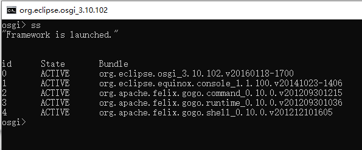

###  Equinox Mini 2016

##### 说明

提取自Eclipse 4.5.2的OGSi的运行环境，用于替换karaf。

karaf的兼容性太差了，爬虫环境老是报错，发了好长时间还是跑动不起来。

在Eclipse中调试完全没有问题，于是使用提取Eclipse内置 Equinox框架作为爬虫环境。

##### 添加bundle方法

编辑Equinox\configuration\config.ini添加需要的bundle。

注意末尾的格式

##### 启动方法

Win：start.bat

Linux：start.sh

##### jar文件说明

提取自eclipse-committers-mars-2-win32-x86_64_4.5.2，（JDK1.7）

https://archive.eclipse.org/technology/epp/downloads/release/mars/2/eclipse-committers-mars-2-win32-x86_64.zip

#### JDK

JDK版本需要最小1.6

##### Equinox 官方完整版本下载

https://download.eclipse.org/equinox/

也可以下载其他需要的bundle
https://archive.eclipse.org/equinox/drops/R-Mars.2-201602121500/index.php

##### 参考资料

https://blog.csdn.net/weixin_37019155/article/details/79888062

